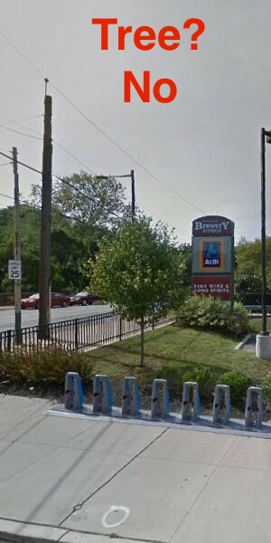
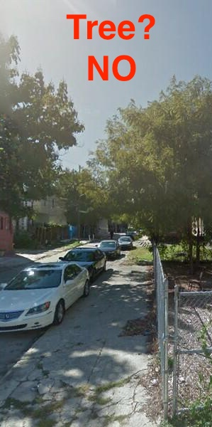
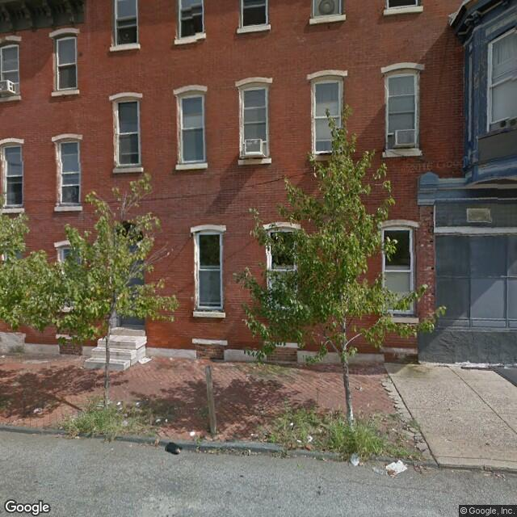

## Intro

In a past life I was a real estate broker. As a broker, I noticed that real estate price prediction algorithms didn't seem to adequately account for the things that most affected my clients’ purchasing behavior. My clients would spend much of their time discussing the number of trees on a block, the trash on the street, the number of abandoned houses on a block, and the construction on a block. Real estate algorithms seemed to analyze price/sq.ft, adjacency to a school or crime in a neighborhood. All good factors to consider, but not the gritty, on the ground analysis my clients needed. Especially in redeveloping neighborhoods in old cities, young buyers, are looking to purchase potential.

I listened to a podcast about a year and a half ago regarding two data scientists that trained an algorithm to identify year, make and model of vehicles on the street via Google Street View. [They were able to use this information to very accurately predict election results](images/pnas.pdf).

Fundamentally, real estate is local and grounded in the physical space directly viewable to the human eye. In Philadelphia, being a very provincal city, this is even more the case than many cities. Antedotally, I bought a house 4 blocks away from a friend. My house cost 5 times less. It is difficult for a 30,000 foot algorithm to take into account the small details of the literal, on the ground, built envirnoment that buyer's take into account when purchasing real estate.

# Curb appeal

## Objective

Curb Appeal is my attempt to try to capture a small piece of the on-the ground factors affectings real estate prices.

1 - Using a **convolutional neural network**, build an algorithm to **count** the **number of trees on a block**

2 - Using a simple **linear regression model**, predict real estate prices with publicly available real estate data

3 - Create 'number of trees on a block' as an **additional feature** in the linear regression model and see if this improves price predictions

## Table of Contents

1. [Dataset - Collection, Preprocessing and Creation](#dataset)
	
	* [Fetch](#fetch)
	* [Label](#label)
	* [Resize](#resize)
	* [Feed](#feed)

2. [Real Estate Analysis - Minus Trees](#real-estate-analysis)

	* [Model Architecture](#model-architecture)
	* [Model Training](#model-training)
	* [Results](#results)
3. [All together now](#all-together-now)

	* [Model Architecture](#model-architecture)
	* [Model Training](#model-training)
	* [Results](#results)

## Dataset - Collection Preprocessing and Creation

My pipeline moves in the following fashion:

	Fetch -> Label -> Resize -> Feed to Convoluted Network

#### Fetch

I wrote [fetch_images.py](fetch_images.py) to utilize [Google Street View (GSV) API](https://developers.google.com/maps/documentation/streetview/) and [GSV meta data API](https://developers.google.com/maps/documentation/streetview/metadata) to perform operations in the following manner.

1. Given a street name and a block range, (e.g. 'N 26th st', 1300-1500 blocks) my script will calibrate its heading, then set the camera to take pictures at a 90 degree angle on each side of the car. The heading resets at the beginnin of every block

2. Each picture is checked against the last picture to make sure it is not a repeat.

3. Each original picture is saved as house number, street name, city, state and zip. E.g. '1338_n_26th_st_philadelphia_pa_19121.jpg'

4. At the end of each series of fetches, the script will write to a pandas dataframe the time, date, and number of fetches and report this back to the user(GSV will allow 25,000 free images a day)

#### Label 
After fetching, the process moves through [label_pics.py](label_pics.py). Label pics heavily utilizes [OpenCV](http://opencv.org/). The OpenCV build [is specific](https://github.com/opencv/opencv_contrib) and can be installed via 'pip install opencv-contrib-python'.

One of the challenges of labeling is to decide what is a tree and what is not.

I decided that since I am measuring curb appeal I want to count trees that are a part of the sidewalk archicture, not trees visible in the background. As such, I only counted trees which were approximately straight on in my photos, a part of the sidewalk, and had a part of their trunk visible.

Intersections proved especially problimatic, since often the angle of the camera was off. Again, if the tree was directly orthogonal to the path of the car, I counted it as a tree. See examples below:

The process of labeling happens in the following manner:

1. Folder of pics to label is specified.

2. The labeler splits the photo in half and displays each image for labeling.

3. I 'yes tree' or 'no tree' for each split image.

4. The labeler than mirrors the photo with my assigned label and saves.

5. E.g. image -> image split into image1, image2 -> image1 displayed and assigned label -> image1 mirrored

	from original image 4 images saved in following manner:
	
	image1
	image1_flip
	image2
	image2_flip
	
6. Every 100 pics, the labeler script will save the filename and label to a pandas dataframe as well as saving a backup.

#### Resize
After labeling, the pictures are resized. Again, using OpenCV in the following manner.

1. Folder of labeled pics is specified.

2. Each picture is resized. This can be specified, in my particular case images are 600x600 from GSV(max resolution from GSV is 1000x1000). They are then split vertically, so when split they become 600x300. When resized the images become 150x50.

3. The resized image is saved for record keeping and bookkeeping purposes.

4. When reading an image, OpenCV converts it to a [numpy array](http://www.numpy.org/). This array along with the filename is saved to a pandas dataframe.

#### Feed - Convolutional Neural Network (CNN)

I now have two separate dataframes, one containing filename and labels, and another containing filename and numpy arrays. I perform the following operations in [cnn.py](cnn.py)

1. Each datafame is loaded

2. The dataframes are joined on filename

3. I now have one dataframe containing filename, label, and numpy array

4. The arrays and labels are formated in the correct manner to feed into [Keras](https://keras.io/)

5. The information passes through the CNN and I am able to see the accuracy of the model predictions.

6. If the accuracy of the model beats previous model accuracy's, then model is saved to used for the prediction stage.

I obtained the public property data set from [Open Data Philly](https://www.opendataphilly.org/dataset/opa-property-assessments)

### Real Estate Data

........?????..........

## Convolutional Neural Network

[....!!!brief history of neural network!!!......](https://en.wikipedia.org/wiki/Convolutional_neural_network)

### Model Architecture

### Model Training

### Results

## Real Estate Analysis - Minus Trees

### Model Architecture

### Model Training

## All together now

## Edited out:
