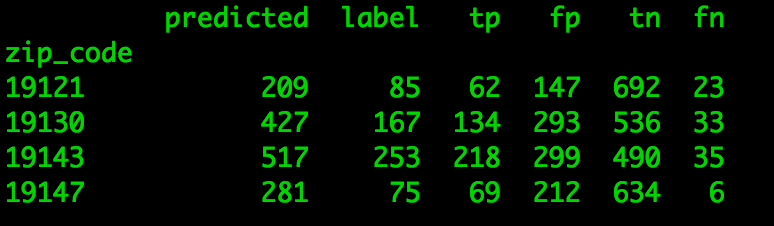

# Curb Appeal

In a past life I was a real estate broker. As a broker, I always noticed that real estate price prediction algorithms didn't seem to adequately account for the things that most affected my clients’ purchasing behavior. My clients would spend much of their time discussing the number of trees on a block, the trash on the street, the number of abandoned houses on a block, and the construction on a block. Real estate algorithms seem to analyze price/sq.ft, adjacency to a school or crime in a neighborhood. All good factors to consider, but not the gritty, on the ground analysis my clients need. Especially in redeveloping neighborhoods in old cities, young buyers, are looking to purchase potential.

I listened to a podcast about a year and a half ago regarding two data scientists that trained an algorithm to identify year, make and model of vehicles on the street via Google Street View. They were able to use this information to very accurately predict election results.

Real estate is fundamentally extremely local. In Philadelphia, even more so than many cities. Antedotally, I bought a house 4 blocks away from a friend. My house cost 5 times less. It is difficult for algorithms 30,000 feet algorithims to take the small details of the built envirnoment into account.

## Objective

Curb Appeal is my attempt to try to capture a small piece of the on-the ground factors affectings real estate prices.

1 - Using a **convolutional neural network**, build an algorithm to **count** the **number of trees on a block***.

2 - Use a **linear regression model** to predict real estate prices with the given publicly available data

3 - Pass in 'number of trees on a block' as an **additional feature** and see if this improves price predictions

## Table of Contents

1. [Dataset](#dataset)

2. [Preprocessing](#preprocessing)
3. [Convolutional Neural Network](#convolutional-neural-network)

	* [Model Architecture](#model-architecture)
	* [Model Training](#model-training)
	* [Results](#results)
4. [Real Estate Analysis - Minus Trees](#real-estate-analysis)

	* [Model Architecture](#model-architecture)
	* [Model Training](#model-training)
	* [Results](#results)
5. [All together now](#all-together-now)

	* [Model Architecture](#model-architecture)
	* [Model Training](#model-training)
	* [Results](#results)

## Dataset

I used a [Google Street View API](https://developers.google.com/maps/documentation/streetview/) and [GSV meta data API](https://developers.google.com/maps/documentation/streetview/metadata) to obtain pictures for each neighborhood. I wrote a [class](insert link) to fetch pictures according to my specifications and to avoid saving duplicates

I obtained the public property data set from [Open Data Philly](https://www.opendataphilly.org/dataset/opa-property-assessments)

## Preprocessing

### Collection:

I wrote my GSV class to perform following operations:

	Go to a specified block

	At the beginning of each block, check the direction of the block

	Based upon the direction of the block set the heading for the camera

	Fetch all picture on the even side of the block orthogonal to the heading

	Fetch all pictures on the odd side of the block orthogonal to the heading

	Check each fetched pictures against existing pictures

	Save the fetched picture if it is original

	Save the fetched picture in the form:

		'street number_street direction_street name_city_state_zip'

		'1245_n_25th_st_philadelphia_pa_19121'

### Labeling:

One of the challenges of labeling is to decide what is a tree and what is not.

I decided that since I am measuring curb appeal I want to count trees that are a part of the sidewalk archicture, not trees visible in the background. As such, I only counted trees which were approximately straight on in my photos, a part of the sidewalk, and had a part of their trunk visible.

Intersections proved especially problimatic, since often the angle of the camera was off. Again, if the tree was directly orthogonal to the path of the car, I counted it as a tree. See examples below:

Each of these split pictures I then mirrored. Thus, from one GSV picture I was able to obtain 4 labeled images.

I took each picture obtained from GSV, split it in half and labeled it 'tree' or 'no tree'.

### Scaling

After labeling, using [OpenCV](http://opencv.org/) I resized the images to 100x50 pixels

### Bookkeeping

Using [pandas](https://pypi.python.org/pypi/pandas/) I saved a data frame of all labeled pics

And all resized pictures as numpy arrays

### Real Estate Data

........?????..........

## Convolutional Neural Network

[....!!!brief history of neural network!!!......](https://en.wikipedia.org/wiki/Convolutional_neural_network)

### Model Architecture

### Model Training

### Results

## Real Estate Analysis - Minus Trees

### Model Architecture

### Model Training

## All together now

## Edited out:
